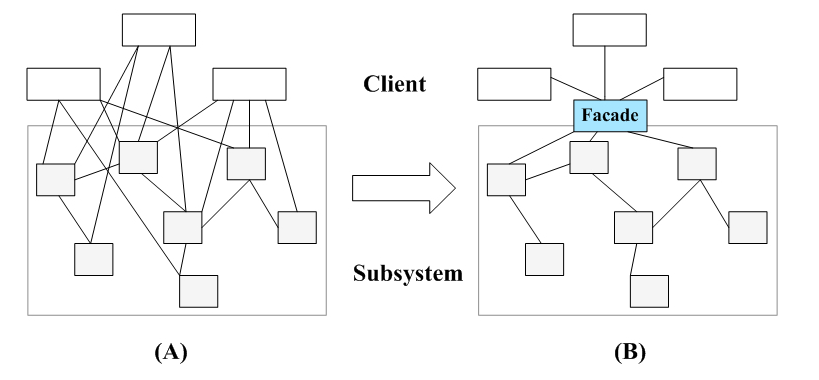
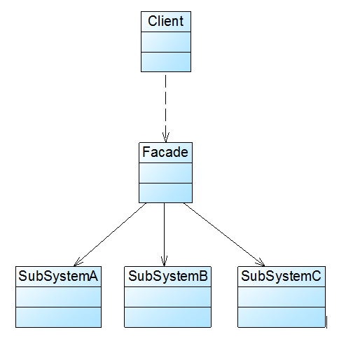
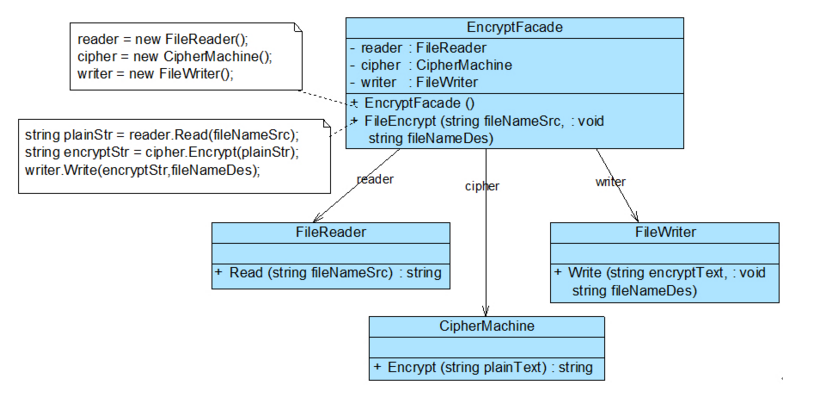
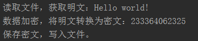
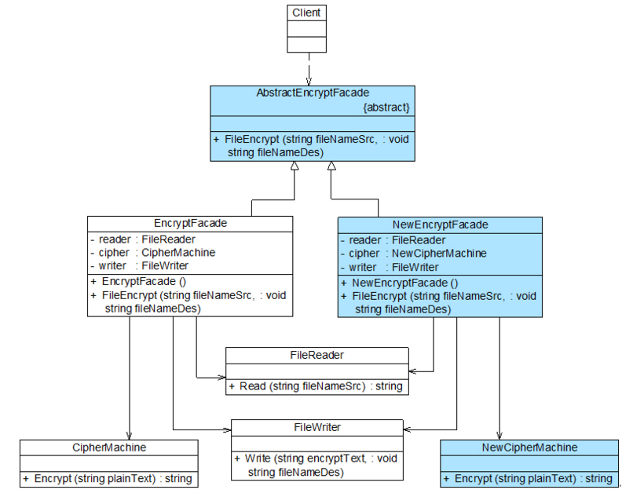

# **外观模式**
>####  外观模式：为子系统中的一组接口提供一个统一的入口。外观模式定义了一个高层接口，这个接口使得这一子系统更加容易使用。
>####  外观模式是一种使用频率非常高的结构型设计模式，它通过引入一个外观角色来简化客户端与子系统之间的交互，为复杂的子系统调用提供一个统一的入口，降低子系统与客户端的耦合度，且客户端调用非常方便。
---

###  一：**模式概述**
>#### 在软件开发中，有时候为了完成一项较为复杂的功能，一个客户类需要和多个业务类交互，而这些需要交互的业务类经常会作为一个整体出现，由于涉及到的类比较多，导致使用时代码较为复杂，此时，特别需要一个类似服务员一样的角色，由它来负责和多个业务类进行交互，而客户类只需与该类交互。外观模式通过引入一个新的外观类(Facade)来实现该功能，外观类充当了软件系统中的“服务员”，它为多个业务类的调用提供了一个统一的入口，简化了类与类之间的交互。在外观模式中，那些需要交互的业务类被称为子系统(Subsystem)。如果没有外观类，那么每个客户类需要和多个子系统之间进行复杂的交互，系统的耦合度将很大，如下图(A)所示；而引入外观类之后，客户类只需要直接与外观类交互，客户类与子系统之间原有的复杂引用关系由外观类来实现，从而降低了系统的耦合度，如下图(B)所示。

---
###  二：**模式结构**
>###  外观模式包含如下两个角色：

>#### 1、Facade（外观角色）：在客户端可以调用它的方法，在外观角色中可以知道相关的（一个或者多个）子系统的功能和责任；在正常情况下，它将所有从客户端发来的请求委派到相应的子系统去，传递给相应的子系统对象处理。

>#### 2、 SubSystem（子系统角色）：在软件系统中可以有一个或者多个子系统角色，每一个子系统可以不是一个单独的类，而是一个类的集合，它实现子系统的功能；每一个子系统都可以被客户端直接调用，或者被外观角色调用，它处理由外观类传过来的请求；子系统并不知道外观的存在，对于子系统而言，外观角色仅仅是另外一个客户端而已。外观模式中所指的子系统是一个广义的概念，它可以是一个类、一个功能模块、系统的一个组成部分或者一个完整的系统。子系统类通常是一些业务类，实现了一些具体的、独立的业务功能
>####  外观模式的结构图如下：
        
         
---

###  三：**具体实现**
>#### 外观模式的主要目的在于降低系统的复杂程度，在面向对象软件系统中，类与类之间的关系越多，不能表示系统设计得越好，反而表示系统中类之间的耦合度太大，这样的系统在维护和修改时都缺乏灵活性，因为一个类的改动会导致多个类发生变化，而外观模式的引入在很大程度上降低了类与类之间的耦合关系。引入外观模式之后，增加新的子系统或者移除子系统都非常方便，客户类无须进行修改（或者极少的修改），只需要在外观类中增加或移除对子系统的引用即可。从这一点来说，外观模式在一定程度上并不符合开闭原则，增加新的子系统需要对原有系统进行一定的修改，虽然这个修改工作量不大。

>#### 某软件公司欲开发一个可应用于多个软件的文件加密模块，该模块可以对文件中的数据进行加密并将加密之后的数据存储在一个新文件中，具体的流程包括三个部分，分别是读取源文件、加密、保存加密之后的文件，其中，读取文件和保存文件使用流来实现，加密操作通过求模运算实现。这三个操作相对独立，为了实现代码的独立重用，让设计更符合单一职责原则，这三个操作的业务代码封装在三个不同的类中。
>#### 文件加密模块结构图:
      
>#### 在上图中，EncryptFacade充当外观类，FileReader、CipherMachine和FileWriter充当子系统类。

>#### 1、 FileReader：文件读取类，充当子系统类。
``` 
public class FileReader {
    public String read(String fileNameSrc) {
        System.out.print("读取文件，获取明文：");
        StringBuffer sb = new StringBuffer();
        try {
            FileInputStream inFS = new FileInputStream(fileNameSrc);
            int data;
            while ((data = inFS.read()) != -1) {
                sb = sb.append((char) data);
            }
            inFS.close();
            System.out.println(sb.toString());
        } catch (FileNotFoundException e) {
            System.out.println("文件不存在！");
        } catch (IOException e) {
            System.out.println("文件操作错误！");
        }
        return sb.toString();
    }
} 
```

>#### 2、CipherMachine：数据加密类，充当子系统类。
``` 
public class CipherMachine {
    public String encrypt(String plainText) {
        System.out.print("数据加密，将明文转换为密文：");
        String es = "";
        for (int i = 0; i < plainText.length(); i++) {
            String c = String.valueOf(plainText.charAt(i) % 7);
            es += c;
        }
        System.out.println(es);
        return es;
    }
}
```
>#### 3、FileWriter：文件保存类，充当子系统类。
```
public class FileWriter {
    public void write(String encryptStr, String fileNameDes) {
        System.out.println("保存密文，写入文件。");
        try {
            FileOutputStream outFS = new FileOutputStream(fileNameDes);
            outFS.write(encryptStr.getBytes());
            outFS.close();
        } catch (FileNotFoundException e) {
            System.out.println("文件不存在！");
        } catch (IOException e) {
            System.out.println("文件操作错误！");
        }
    }
}
```
>#### 4、EncryptFacade：加密外观类，充当外观类。

```
public class EncryptFacade {
    //维持对其他对象的引用
    private FileReader reader;
    private CipherMachine cipher;
    private FileWriter writer;

    public EncryptFacade() {
        reader = new FileReader();
        cipher = new CipherMachine();
        writer = new FileWriter();
    }

    //调用其他对象的业务方法
    public void fileEncrypt(String fileNameSrc, String fileNameDes) {
        String plainStr = reader.read(fileNameSrc);
        String encryptStr = cipher.encrypt(plainStr);
        writer.write(encryptStr, fileNameDes);
    }
}

```
>#### 客户端测试类：
```
public class Client {
    public static void main(String args[]) {
        EncryptFacade ef = new EncryptFacade();
        File directory = new File("");// 参数为空
        try {
            String courseFile = directory.getCanonicalPath();
            ef.fileEncrypt(courseFile + "/src/main/resources/facade/src.txt", courseFile + "/src/main/resources/facade/des.txt");
        } catch (IOException e) {
            e.printStackTrace();
        }
    }
}
```
>####  编译并运行程序，输出结果如下：


>####  在本实例中，对文件src.txt中的数据进行加密，该文件内容为“Hello world!”，加密之后将密文保存到另一个文件des.txt中，程序运行后保存在文件中的密文为“233364062325”。在加密类CipherMachine中，采用求模运算对明文进行加密，将明文中的每一个字符除以一个整数（本例中为7，可以由用户来进行设置）后取余数作为密文。

>### 抽象外观类
>#### 在标准的外观模式结构图中，如果需要增加、删除或更换与外观类交互的子系统类，必须修改外观类或客户端的源代码，这将违背开闭原则，因此可以通过引入抽象外观类来对系统进行改进，在一定程度上可以解决该问题。在引入抽象外观类之后，客户端可以针对抽象外观类进行编程，对于新的业务需求，不需要修改原有外观类，而对应增加一个新的具体外观类，由新的具体外观类来关联新的子系统对象。
>#### 引入抽象外观类之后的文件加密模块结构图:


>#### 如果在应用实例“文件加密模块”中需要更换一个加密类，不再使用原有的基于求模运算的加密类CipherMachine，而改为基于移位运算的新加密类NewCipherMachine，其代码如下：

```
public class NewCipherMachine {
    public String encrypt(String plainText) {
        System.out.print("数据加密，将明文转换为密文：");
        String es = "";
        int key = 10;//设置密钥，移位数为10
        char[] chars = plainText.toCharArray();
        for(char ch :chars){
            int temp = Integer.valueOf(ch);
            //小写字母移位
            if (ch >= 'a' && ch <= 'z') {
                temp += key % 26;
                if (temp > 122) temp -= 26;
                if (temp < 97) temp += 26;
            }
            //大写字母移位
            if (ch >= 'A' && ch <= 'Z') {
                temp += key % 26;
                if (temp > 90) temp -= 26;
                if (temp < 65) temp += 26;
            }
            es += ((char)temp);
        }
        System.out.println(es);
        return es;
    }
}
```
>#### 如果不增加新的外观类，只能通过修改原有外观类EncryptFacade的源代码来实现加密类的更换，将原有的对CipherMachine类型对象的引用改为对NewCipherMachine类型对象的引用，这违背了开闭原则，因此需要通过增加新的外观类来实现对子系统对象引用的改变。
>#### AbstractEncryptFacade:抽象外观类
```
public abstract class AbstractEncryptFacade {
    public abstract void FileEncrypt(String fileNameSrc, String fileNameDes);
}
```
>#### NewEncryptFacade:新增具体加密外观类

```
public class NewEncryptFacade extends AbstractEncryptFacade  {
    private FileReader reader;
    private NewCipherMachine cipher;
    private FileWriter writer;

    public NewEncryptFacade() {
        reader = new FileReader();
        cipher = new NewCipherMachine();
        writer = new FileWriter();
    }
    @Override
    public void FileEncrypt(String fileNameSrc, String fileNameDes) {
        String plainStr = reader.read(fileNameSrc);
        String encryptStr = cipher.encrypt(plainStr);
        writer.write(encryptStr, fileNameDes);
    }
} 
```
>#### 客户端测试代码:
```
public void testTestAbstract() throws Exception {
        NewEncryptFacade nef = new NewEncryptFacade();
        File directory = new File("");// 参数为空
        try {
            String courseFile = directory.getCanonicalPath();
            nef.FileEncrypt(courseFile + "/src/main/resources/facade/src.txt", courseFile + "/src/main/resources/facade/des.txt");
        } catch (IOException e) {
            e.printStackTrace();
        }
    }
```
>####  编译并运行程序，输出结果如下：
```
读取文件，获取明文：Hello world!
数据加密，将明文转换为密文：Rovvy gybvn!
保存密文，写入文件。
```
---
###  四：**模式优缺点**
>### 优点：
>####  1、它对客户端屏蔽了子系统组件，减少了客户端所需处理的对象数目，并使得子系统使用起来更加容易。通过引入外观模式，客户端代码将变得很简单，与之关联的对象也很少。
>####  2、它实现了子系统与客户端之间的松耦合关系，这使得子系统的变化不会影响到调用它的客户端，只需要调整外观类即可。
>####  3、一个子系统的修改对其他子系统没有任何影响，而且子系统内部变化也不会影响到外观对象。

>### 缺点：
>####  1、不能很好地限制客户端直接使用子系统类，如果对客户端访问子系统类做太多的限制则减少了可变性和灵活 性。
>####  2、如果设计不当，增加新的子系统可能需要修改外观类的源代码，违背了开闭原则。

---
###  五：**适用场景**

>#### 1、 当要为访问一系列复杂的子系统提供一个简单入口时可以使用外观模式。

>#### 2、客户端程序与多个子系统之间存在很大的依赖性。引入外观类可以将子系统与客户端解耦，从而提高子系统的独立性和可移植性。

>#### 3、在层次化结构中，可以使用外观模式定义系统中每一层的入口，层与层之间不直接产生联系，而通过外观类建立联系，降低层之间的耦合度。

---


###  六：**总结**

>#### 外观模式是一种使用频率非常高的设计模式，它通过引入一个外观角色来简化客户端与子系统之间的交互，为复杂的子系统调用提供一个统一的入口，使子系统与客户端的耦合度降低，且客户端调用非常方便。外观模式并不给系统增加任何新功能，它仅仅是简化调用接口。在几乎所有的软件中都能够找到外观模式的应用，如绝大多数B/S系统都有一个首页或者导航页面，大部分C/S系统都提供了菜单或者工具栏，在这里，首页和导航页面就是B/S系统的外观角色，而菜单和工具栏就是C/S系统的外观角色，通过它们用户可以快速访问子系统，降低了系统的复杂程度。所有涉及到与多个业务对象交互的场景都可以考虑使用外观模式进行重构。
